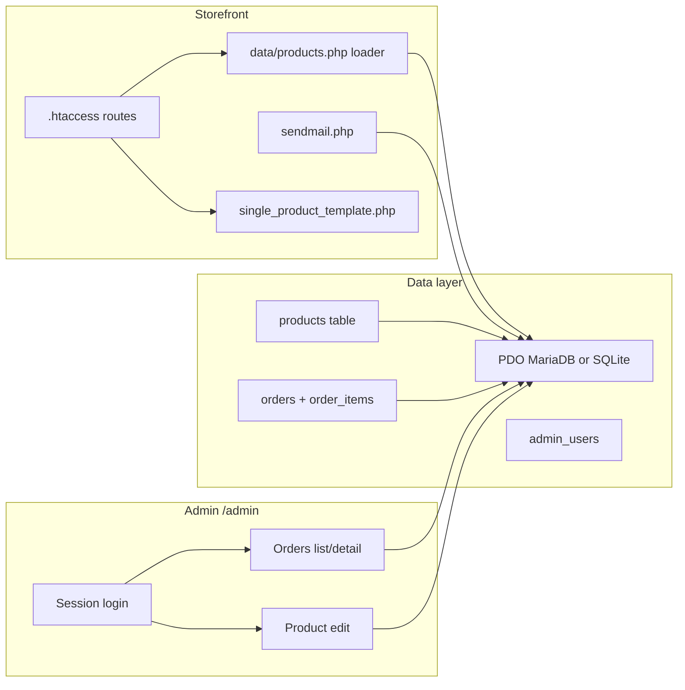

ц---
name: DB Admin Auth Plan
overview: Introduce a relational database via PDO (MariaDB recommended for production; SQLite viable for dev or controlled low-traffic hosting), persist orders, load products from the DB while keeping storefront templates working, and add a separate `/admin` area with session auth and CSRF-protected forms. Implement a new cart system without `wicart.js`, ensuring fast performance and integration with AMO and database storage.
todos:
  - id: schema-config
    content: Add SQL schema (admin_users, products, orders, order_items, customers, order_sequence), PDO config outside git, and .gitignore for secrets inside /dev
    status: pending
  - id: new-cart-frontend
    content: Implement new cart functionality on the frontend (HTML/CSS/JS) without wicart.js, maintaining visual and functional parity. Ensure client-side validation and quick response times.
    status: pending
  - id: htaccess-admin
    content: Update .htaccess to exclude /admin (and assets) from product catch-all routing
    status: pending
  - id: products-loader
    content: In /dev, replace static data/products.php array with DB loader preserving $products shape; add seed/migration from current data
    status: pending
  - id: orders-persist
    content: In /dev, insert orders + order_items in sendmail.php inside a transaction, migrate order numbering from counter.txt to DB with fallback, and link to customer records.
    status: pending
  - id: amo-integration
    content: Modify sendmail.php to send order data to AMO CRM after successful database persistence, leveraging existing AMO integration code if possible, or implementing a new, robust integration.
    status: pending
  - id: hardening-nonbreaking
    content: Hardening checklist to keep existing flows stable (order-number concurrency, double-submit prevention, upload security, logging, rollback/backfill plan)
    status: pending
  - id: admin-auth-ui
    content: Implement /dev/admin with Orders as default page and Products management with image upload + full field editing
    status: pending
  - id: product-seo-fields
    content: Add product SEO fields (seo_title, seo_description) in /dev admin editor and fallback behavior in /dev product template
    status: pending
  - id: customers-linking
    content: Add non-auth customers entity (name/email/phone) and link orders to customers for history, filtering, and profile view in /dev
    status: pending
  - id: admin-extra-pages
    content: Add practical /dev/admin sections (dashboard, customers, promotions, settings, logs) with MVP/prioritized rollout
    status: pending
isProject: false
---

# Database, admin authentication, and admin panel

## Current state (findings)

- **Products**: A large PHP array in `[data/products.php](data/products.php)` defines every field the templates expect (`id`, `cat_number`, `name`, `price`, `old_price`, `image`, `link`, `short_desc`, `desc`, `full_desc`, `in_stock`, optional `status`, etc.). `[templates/single_product_template.php](templates/single_product_template.php)` resolves the URL path against `$products[].link`.
- **Orders**: `[sendmail.php](sendmail.php)` assigns order numbers from `[counter.txt](counter.txt)`, builds email HTML, includes `[rest.php](rest.php)` (Bitrix lead integration). There is **no durable order store** in the repo—only mail/CRM side effects.
- **Integrations**: the codebase already sends orders outward (email + CRM/Amo). The admin/DB work must be **additive**, not a rewrite of existing outbound flows.
- **Stack**: Classic PHP + Apache rewrite rules in `[.htaccess](.htaccess)`; **no Composer**. Any DB layer should be **PDO** with prepared statements.

### Development workspace rule (confirmed)

- All new development must be created under a new root directory: `dev/`.
- Existing production root files are treated as drafts/reference only.
- `dev/` must be a **self-contained project root** with all required runtime assets included.
- New/modified implementation targets become `/dev/...` equivalents (e.g. `/dev/admin`, `/dev/config`, `/dev/sendmail.php`, `/dev/templates/*`).
- Final deployment model: archive **only** `dev/` and upload it as the site root; app must run immediately without depending on files outside `dev/`.

### Deployment mode (confirmed): zip-and-upload from `dev/`

- The `dev/` directory must be **self-contained** and deployable as-is.
- Goal: you can archive `dev/`, upload to hosting, extract, and the site works immediately.
- No build step, no composer install, no node build required on server.
- All runtime-required files (PHP, templates, css/js/assets, SQL migrations, admin pages, config examples) must be inside `dev/` except environment-specific secret files.
- Include a clear `dev/README_DEPLOY.md` with 1-pass deploy steps (DB import, config placement, permissions, smoke checks).
- Include `dev/config/local.php.example`; actual `local.php` is created on server and not committed.

**Related security note (out of scope unless you ask):** `[rest.php](rest.php)` contains live CRM credentials in source. A follow-up should move secrets to environment variables or a file outside the web root and **never** commit them.

---

## Recommended architecture

---

## 1. SQLite vs MariaDB (продуктивность и простота перенастройки)

### Про скорость в вашем случае

Магазин с десятками/сотнями товаров, чтение каталога на каждую страницу и **редкие** записи заказов — для SQLite и MariaDB это тривиальная нагрузка. Время ответа страницы на практике ограничивается **PHP, шаблонами, сетью и почтой/CRM**, а не выбором между этими СУБД. «Максимальная продуктивность» в смысле latency каталога у обоих будет на одном порядке, пока нет тысяч одновременных записей или тяжёлых отчётов.

### SQLite — плюсы и минусы

**Плюсы**

- Очень простой старт: один файл БД, не нужен отдельный сервер и учётные записи MySQL.
- Удобная локальная разработка и бэкап «скопировал файл».
- Перенастройка кода минимальна: другой DSN в PDO (`sqlite:/path/to/db.sqlite`).

**Минусы**

- **Запись по сути сериализуется** (один писатель за раз); при пиках (много заказов одновременно + админ сохраняет товар) возможны очереди. Для небольшого магазина часто приемлемо; для роста — риск.
- На **shared hosting** SQLite иногда отключён, ограничен или БД на NFS — нестабильно или медленнее.
- Файл БД **нельзя** класть в публичный `public_html`; нужен путь вне web root и жёсткие права — иначе утечка/порча файла.

### MariaDB (или MySQL) — плюсы и минусы

**Плюсы**

- Стандарт для PHP-хостинга: панель, **phpMyAdmin**/Adminer, бэкапы, права пользователя.
- Нормальная модель **много одновременных записей** (заказы + админка).
- Проще потом добавить репликацию, отдельный сервер БД, мониторинг.

**Минусы**

- Чуть больше «операционки»: создать БД, пользователя, DSN с хостом/портом.
- На локалке нужен MariaDB/MySQL (Docker или установка).

### Что проще перенастроить

Код с **PDO и отдельным DSN в конфиге** один раз написан — переключение «SQLite ↔ MariaDB» сводится к **другому DSN и одному набору миграций** (иногда мелкие отличия типов: `AUTO_INCREMENT` vs `INTEGER PRIMARY KEY`, JSON, часть синтаксиса). Проще всего **не** смешивать экзотические фичи и держать SQL в двух маленьких файлах миграций под выбранный движок, либо один общий SQL без vendor-lock там, где возможно.

### Итоговая рекомендация для этого проекта

| Сценарий                                                                  | Рекомендация                                                                                                                                                                              |
| ------------------------------------------------------------------------- | ----------------------------------------------------------------------------------------------------------------------------------------------------------------------------------------- |
| **Боевой хостинг с типичным PHP** (как у olaplex-shop)                    | **MariaDB** (или MySQL): предсказуемо, привычно хостеру, лучше под одновременные заказы и работу админки.                                                                                 |
| **Только локалка / VPS под полным контролем**, мало одновременных заказов | **SQLite** допустим и быстро внедряется; файл строго вне корня сайта, режим WAL.                                                                                                          |
| **Нужен один стек «и dev и prod»**                                        | Dev может быть SQLite, prod MariaDB — при простом PDO и миграциях это нормальная схема, если готовы поддерживать два варианта DDL или использовать подмножество SQL совместимое с обоими. |

**Практический вывод:** для «максимальной продуктивности» в смысле **стабильности под нагрузкой и типичный хостинг** — **MariaDB**. SQLite не даст заметного выигрыша в скорости чтения каталога на этом объёме данных, но может упростить первый шаг там, где MySQL нет.

### Final decision (confirmed)

- **Production DB**: `MariaDB` (final choice).
- SQLite remains optional for local development only.

---

## 2. Database configuration (PDO)

- **Production default**: **MariaDB / MySQL** (см. раздел 1).
- Add a small **PDO bootstrap** (e.g. `[config/db.php](config/db.php)`) reading **DSN, user, password** from a file **outside version control** (e.g. `config/local.php` gitignored) or from server env vars. Never hardcode credentials in git-tracked files. For SQLite, DSN points to a path **outside** the web root.

**Core tables (minimal viable):**

| Table            | Purpose                                                                                                                                                                                                                                                                                                                  |
| ---------------- | ------------------------------------------------------------------------------------------------------------------------------------------------------------------------------------------------------------------------------------------------------------------------------------------------------------------------ |
| `admin_users`    | `id`, `email` or `username`, `password_hash` (`password_hash()` with `PASSWORD_DEFAULT`), `created_at`, optional `last_login`                                                                                                                                                                                            |
| `customers`      | Non-auth customer entity with full contact profile from existing form/handlers: `id`, `full_name`, `email`, `phone`, `contact_method`, `contact_username`, `phone_normalized`, `email_normalized`, `first_order_number`, `last_order_number`, `orders_count`, `total_spent`, `created_at`, `updated_at`, `last_order_at` |
| `order_sequence` | Single-row sequence/state table storing the current order counter migrated from `[counter.txt](counter.txt)`                                                                                                                                                                                                             |
| `products`       | Columns matching storefront needs: stable `slug`/`link` (e.g. `/hair_perfector`), prices, text fields, `in_stock`, image path, plus SEO fields `seo_title` and `seo_description`. Add indexes on `link` (unique) and optionally `id` (catalog id used in cart)                                                          |
| `orders`         | `id`, public `order_number` (replaces or mirrors `#OLA-`*), `customer_id` FK, customer snapshot fields from POST, `total`, `coupon`, `created_at`, optional `raw_payload` JSON for audit                                                                                                                                 |
| `order_items`    | `order_id` FK, product reference (`product_id` or catalog `id`), snapshot `name`, `price`, `quantity`, `catalog_number`                                                                                                                                                                                                  |

For MariaDB: use **InnoDB**, **UTF8MB4**, and **foreign keys** where helpful.

### Clarification: admin users vs site customers

- **Admin auth remains required** for `/admin`, so `admin_users.password_hash` stays in scope.
- **Site customers are not registered users**: no login, no password hash, no registration flow.
- Customer data comes from order form fields (`full_name`, `email`, `phone`) and is used for linking order history.

---

## 3. Migrating products without rewriting every template

**Pattern:** Keep the public contract as `$products` array.

- Replace the **static array** in `[data/products.php](data/products.php)` with: open DB → `SELECT ... ORDER BY ...` → build the same structure as today (same keys). If DB connection fails, optionally fall back to a **read-only static snapshot** for resilience (optional).
- **One-time seed**: a CLI or browser-guarded script (run once, then delete/disable) that `INSERT`s rows parsed from the current array or from a JSON export of `[data/products.php](data/products.php)`.
- **Admin product editing**: `UPDATE products SET ...` for `price`, `old_price`, `desc`, `full_desc`, `short_desc`, `in_stock`, etc. Editing **slug** (`link`) should remain careful because it changes public URLs and SEO—either restrict in UI or add validation.

`[create_feed.php](create_feed.php)` and any code that `include`s `[data/products.php](data/products.php)` continue to work once the loader returns `$products`.

---

## 4. Persisting orders

In `[sendmail.php](sendmail.php)`, **after** validating POST data and computing `$counter` / totals:

- Read the last value from `[counter.txt](counter.txt)` during migration/setup and initialize DB order numbering from it.
- On each new order, obtain the next order number from DB first (e.g. `15000` in storage means next order becomes `15001`).
- Start a transaction: atomically increment the DB order counter, insert `orders`, then `order_items` (store **line snapshots** from `$orderResult`, not only IDs—prices in cart are client-submitted today; consider **server-side price lookup by product id** in a later hardening pass).
- Commit.

### Customer linking logic (non-auth)

- On order create, try to find an existing `customers` record by normalized phone first, then by email.
- If found, use its `customer_id`; otherwise create a new customer row.
- Store a customer snapshot in `orders` too (name/email/phone at time of purchase) so historical orders remain accurate even if customer data later changes.
- This enables: “Customer Ivanov Ivan Ivanovich had orders 13809 and 14001 with different items”.

### Dedup policy (confirmed)

- Final customer dedup priority:
  1. `phone_normalized` (primary match key),
  2. `email_normalized` (secondary fallback),
  3. if neither matches -> create new customer.

### Customer fields audit from current project files

From existing order flow (`[templates/order_form.php](templates/order_form.php)`, `[js/wicart.js](js/wicart.js)`, `[sendmail.php](sendmail.php)`, `[amo/order.php](amo/order.php)`), customer-related values currently sent/used are:

- `name` (full name in one field),
- `phone`,
- `email`,
- `contact_method` (`whatsapp` / `telegram` / `max`),
- `contact_username` (messenger handle or WhatsApp number),
- `comments` currently used mostly as delivery/address text (keep in `orders`, not `customers`).

Recommended `customers` columns for this exact flow:

- identity/contact:
  - `full_name`,
  - `phone`,
  - `email`,
  - `contact_method`,
  - `contact_username`;
- normalization/dedup:
  - `phone_normalized` (digits + country normalization),
  - `email_normalized` (lowercase + trim);
- analytics/support in admin:
  - `orders_count`,
  - `total_spent`,
  - `first_order_number`,
  - `last_order_number`,
  - `last_order_at`,
  - `created_at`,
  - `updated_at`.

Recommended `orders` customer snapshot columns (for immutable history):

- `customer_name_snapshot`,
- `customer_phone_snapshot`,
- `customer_email_snapshot`,
- `contact_method_snapshot`,
- `contact_username_snapshot`,
- `delivery_address_snapshot` (from current `comments`/address field).

Index recommendations:

- UNIQUE (or semi-unique business logic) on `phone_normalized`,
- index on `email_normalized`,
- index on `last_order_at`.

### Order number migration from `counter.txt`

- On first deployment, read current value from `[counter.txt](counter.txt)` and seed `order_sequence.current_value`.
- Example: if `[counter.txt](counter.txt)` contains `15000`, the first DB-issued order number must be `15001`.
- After successful cutover, DB becomes the **primary source of truth** for order numbering.
- Keep `[counter.txt](counter.txt)` temporarily as **fallback backup source**, not the primary source.

### Order number generation (important detail to implement correctly)

- **Concurrency-safe increment**: `order_sequence` must be incremented in a way that cannot produce duplicates under parallel orders.
  - MariaDB approach: `SELECT current_value FROM order_sequence FOR UPDATE; UPDATE order_sequence SET current_value = current_value + 1;` inside a transaction, then use the new value as `order_number`.
  - Alternative (MariaDB/MySQL): `UPDATE order_sequence SET current_value = LAST_INSERT_ID(current_value + 1); SELECT LAST_INSERT_ID();` (atomic).
- Add a **UNIQUE** constraint on `orders.order_number` as a safety net.

### Non-breaking guarantee (critical requirement)

The new admin/DB layer must **not** change how orders are currently delivered externally:

- **Email sending stays exactly as before** (same recipients, same HTML, same subject convention like `#OLA-`*).
- **CRM/Amo order delivery stays exactly as before** (Bitrix lead via `[rest.php](rest.php)` and any Amo flow already wired in).
- DB persistence is **additional**: it should not block or regress the existing “order succeeded” experience.

### Failure policy (recommended)

- If DB insert fails: still execute the **existing** email + CRM/Amo sending path, and log the DB error (so ops can replay/import later).
- If email/CRM/Amo fails but DB insert succeeded: return existing error behavior (if any) but keep DB record; add a status flag so admin can see “outbound failed” and retry manually (optional follow-up).

### Fallback mode if DB is unavailable

- If DB connection or DB counter increment fails, revert to the **legacy fallback path**:
  - read/increment `[counter.txt](counter.txt)`,
  - send email as before,
  - send CRM/Amo payload as before.
- This preserves business continuity even when DB is down.
- When fallback mode is used, write a clear log entry so admin/devops knows that some orders may need later backfill into the DB/admin panel.
- Optional later improvement: add a small retry/import tool that scans fallback log entries and inserts missed orders into the DB.

### Observability / replay (recommended)

- Store a `raw_payload` JSON snapshot on the `orders` row (sanitized as needed) and an `outbound_status` (e.g. `email_sent`, `crm_sent`, `amo_sent`) so failures are visible in admin.
- Add a small internal log file (outside web root if possible) for DB/CRM/email exceptions to make debugging safer than printing errors to users.

### Double-submit / idempotency (recommended)

- Users (or JS) can submit the order twice (double click, slow network). Add an **idempotency key**:
  - generate `client_order_uuid` on the client and POST it (best), or compute a short hash server-side,
  - store it in `orders` with a **UNIQUE** constraint,
  - on duplicate request return success and reuse the original `order_number` (prevents duplicated emails/CRM leads).

---

## 5. Admin area: URL layout and Apache

- Physical tree: e.g. `[/admin/index.php](admin/)` (login/dashboard), `[/admin/orders.php](admin/)`, `[/admin/products.php](admin/)` or REST-style `admin/orders/index.php`—keep it small and consistent.
- **Session-based auth** only for `/admin/`*:
  - `session_start()` with **secure cookie flags** when HTTPS: `session.cookie_httponly=1`, `session.cookie_samesite=Lax` or `Strict`, `session.cookie_secure=1` on production HTTPS.
  - `password_verify()` on login; **regenerate session id** on successful login.
- **CSRF**: single token in session; every admin POST form includes a hidden field; validate on server.
- **Brute-force mitigation**: rate-limit login attempts (e.g. by IP + username in DB or `cache` file) or minimum delay—important for “sufficient” admin security.
- **Authorization**: for now a single **admin** role is enough; schema can leave room for `role` later.

Optional: add `[/admin/.htaccess](admin/)` **Deny from all** for any non-PHP static uploads if you add them later; PHP entry points still run via the web server.

**Important:** Add `[/admin](admin/)` to the “real file” path or document that product routing must **not** catch `/admin`—your current rule sends unknown paths to `[templates/single_product_template.php](templates/single_product_template.php)`. You should add a **RewriteCond** excluding `/admin` (and `/css`, `/js`, etc. as needed) **before** the catch-all product rule in `[.htaccess](.htaccess)`.

### Routing architecture review (slug-first)

The current catch-all rewrite works, but it is broad.  
A better long-term approach is: `.htaccess` is only a thin dispatcher, while product routing is explicitly slug-based in app logic.

- **Thin `.htaccess` responsibilities**
  - serve real files/directories directly,
  - never intercept `/admin/*` and technical endpoints,
  - pass only unresolved friendly URLs to product resolver.
- **App resolver responsibilities**
  - parse `REQUEST_URI` to slug (`/hair_perfector`, etc.),
  - lookup product by unique slug field (`products.link` or `products.slug`),
  - return strict 404 when slug does not exist.

Why this is better for your case:

- each product URL is controlled by its own slug (as you requested),
- fewer accidental route conflicts when adding admin/custom pages,
- easier to scale public pages without touching Apache rules repeatedly.

Recommended routing policy:

1. keep existing file/dir bypass in Apache,
2. add explicit exclusions for `/admin`, assets, and service endpoints,
3. route unresolved public URLs to one resolver endpoint,
4. resolver does DB slug lookup + 404.

MVP note: existing `[templates/single_product_template.php](templates/single_product_template.php)` can remain resolver to minimize risk; later you can move the resolver to a front controller without changing slugs.

---

## 6. Admin UI scope (updated with your requirements)

### Navigation and information architecture

- `/admin` opens **Orders** by default (first page after login).
- Second menu item is **Products**.
- Suggested top navigation order:
  - Orders
  - Products
  - (later) Dashboard, Customers, Promotions, Settings, Audit Log

### 6.1 Orders page (first page, detailed)

- **Orders list** (default view):
  - order number (`#OLA-`* or DB order number),
  - date/time,
  - customer name + phone + email,
  - item count (sum of `order_items.quantity`),
  - order total,
  - order status (`new`, `processing`, `shipped`, `completed`, `cancelled`),
  - quick actions: open details, change status.
- **Order detail page**:
  - full customer and delivery/contact data,
  - link to customer profile with all past order numbers,
  - full line items (name, catalog number, quantity, unit price, line total),
  - coupon and comment,
  - technical block: source, created at, optional raw payload snapshot.
- **UX best practices for orders**:
  - filters by status/date/search by phone/order number,
  - pagination,
  - sticky status badge colors,
  - explicit confirmation for destructive actions (cancel/refund if added).

### 6.2 Products page (second page)

- **Products list**:
  - image thumbnail,
  - name/cat number/slug,
  - current price + old price,
  - stock flag,
  - edit button.
- **Create product**:
  - supports field **“Upload photo”** (one primary image in MVP),
  - text fields: `name`, `cat_number`, `short_desc`, `desc`, `full_desc`,
  - SEO fields: `seo_title`, `seo_description`,
  - commerce fields: `price`, `old_price`, `in_stock`,
  - routing field: `link` (slug) with uniqueness validation.
- **Edit product**:
  - all fields editable,
  - image can be replaced, removed, or newly uploaded,
  - keep old image path until successful upload+save transaction.
- **Upload best practices**:
  - validate MIME + extension,
  - generate server-side random filename,
  - limit size (e.g. 2-5 MB),
  - store files outside executable paths if possible; never trust client filename,
  - save only relative safe path in DB.

### 6.4 Product images: storage decision (recommended)

- Store uploaded files in a dedicated directory (e.g. `data/uploads/products/`) with strict extension allowlist and **no PHP execution**.
- In DB store only a relative path like `data/uploads/products/<random>.jpg`.
- (Optional) Generate thumbnails for faster admin lists.

### 6.6 SEO fields in product editor + template fallback

- Add fields in admin product form:
  - `seo_title` (single-line text),
  - `seo_description` (textarea).
- Save rules:
  - trim whitespace on save,
  - allow empty values (fallback mode),
  - optional soft warnings on SEO length (title ~60-70 chars, description ~140-180 chars).
- Template rendering rules for product page:
  - if product `seo_title` is filled -> output it in `<title>`,
  - if empty -> keep current default title.
  - if product `seo_description` is filled -> output it in `<meta name="description">`,
  - if empty -> keep current default description.
- Safety:
  - escape SEO values with `htmlspecialchars(..., ENT_QUOTES, 'UTF-8')` before output.

### SEO default policy (confirmed)

- Keep current default SEO text exactly as it is now for fallback.
- Product-level SEO fields override defaults only when non-empty.

### 6.5 Customers page (non-auth, for filtering and history)

- **Purpose**: customer analytics and order linkage, not authentication.
- **Customer list**:
  - full name, phone, email,
  - preferred contact method + messenger handle,
  - total orders count,
  - first and last order numbers,
  - last order date,
  - total revenue from this customer (optional for MVP).
- **Customer detail page**:
  - customer identity block (name/phone/email),
  - list of all related orders with order numbers and dates,
  - each order expandable to show purchased items.

### 6.3 Admin security for forms and uploads

- CSRF token on all create/update actions.
- Server-side validation for all numeric/text fields (never trust client-side validation only).
- Escape output in admin templates to avoid stored XSS through product descriptions.
- Role check before any write action, even if menu link is hidden.

Reuse **Bootstrap** from the storefront for a consistent, low-effort UI, but keep admin styles scoped to avoid storefront regressions.

---

## 7. Deployment checklist

- Create MySQL database and user; run SQL migrations (hand-written `.sql` files in repo, or a tiny `migrate.php` run once).
- Set `config/local.php` (or env) on the server; chmod restrictive.
- HTTPS for admin (you already force HTTPS in `[.htaccess](.htaccess)`).
- Read `[counter.txt](counter.txt)`, seed the DB order counter, and verify that the next created order uses the next expected number.
- Keep `[counter.txt](counter.txt)` in place during rollout as a fallback path until DB-backed ordering is proven stable.
- Remove or lock down any **migration/seed** script after first use.

---

## 8. Plan review: weak spots and optimizations (make it “best”)

### Biggest weak spots to address early

- **Order-number race conditions**: must be atomic in DB (see “Order number generation”).
- **Double-submit duplicates**: without idempotency you can get duplicated orders and duplicated outbound (email/CRM/Amo).
- **Client-supplied prices**: `sendmail.php` currently trusts `order_result.price` from the browser. MVP can store snapshots, but best-practice is to recalc totals server-side from the `products` table by product id.
- **File upload security**: image upload is a common attack surface; enforce allowlist, size limits, random filenames, safe storage.
- **Secrets handling**: credentials currently exist in code (e.g. `[rest.php](rest.php)`); best practice is secrets outside git and outside web root.

### Operational improvements (keep business continuity)

- **Rollback flag**: ability to disable DB writes quickly and keep legacy order path only (email + CRM/Amo + `counter.txt`).
- **Backfill strategy**: when fallback mode is used, log enough data to later insert missing orders into DB so admin is consistent.
- **User-safe errors**: never print raw exceptions to users; log internally, return a generic message.

### Admin UX optimizations (low effort, high value)

- Orders list: default filter “new”, quick status change, search by phone/order number.
- Product edit: show current image + preview new image before save; confirm before delete/replace.

---

## 9. Optional follow-ups (not required for MVP)

- Re-validate cart **prices server-side** against `products` before order insert (prevents tampering).
- **Audit log** table for admin actions.
- **2FA** (TOTP) for admin.
- Composer + a minimal router or framework only if the project is expected to grow further.

## 10. Additional admin pages to consider (best-practice roadmap)

### MVP+1 (high value soon after launch)

- **Dashboard**
  - today/week/month orders and revenue,
  - top products,
  - recent order activity.
- **Customers**
  - searchable customer list from orders,
  - customer card with order history.
- **Promotions/Coupons**
  - create/edit coupon codes,
  - active period and usage limits.

### Growth stage (when operations expand)

- **Content/SEO**
  - manage homepage blocks/meta tags/canonicals for products.
- **Integrations**
  - CRM/Amo/Bitrix status and last sync errors.
- **Settings**
  - store contacts, delivery text, notification emails, admin account management.
- **Audit log**
  - who changed product price/description/status and when.

### Priority recommendation for this project

1. Orders (default) + Products (with upload/edit) + Login security.
2. Dashboard + Audit log.
3. Customers + Promotions.
4. Settings + Integrations/SEO blocks.

---

## 11. Architecture audit of current project (priority fixes)

### P0 (critical, should be addressed first)

- **Credentials in source code**  
  [`rest.php`](rest.php) contains live CRM login/password constants. Move secrets to non-versioned config or environment variables immediately.

- **Potential runtime bug in CRM integration file**  
  [`rest.php`](rest.php) includes `console.log($_POST['order']);` in PHP code. This is not valid PHP and can break order processing depending on runtime/error settings.

- **Order pipeline has no strict request validation gate**  
  [`sendmail.php`](sendmail.php) accepts payload and performs side effects (counter, mail, CRM/Amo) without strict server-side schema validation and without explicit method/content checks beyond `rest.php`.

- **Price and totals are trusted from client payload**  
  [`js/wicart.js`](js/wicart.js) sends `order_result` with `price`; [`sendmail.php`](sendmail.php) uses it directly for totals. This allows tampering unless server recalculates from trusted product data.

### P1 (high impact / near-term)

- **Routing is too broad at Apache layer**  
  Current catch-all in [`.htaccess`](.htaccess) routes unknown URLs to product template. Keep slug resolver, but narrow Apache rewrites and protect non-product endpoints from accidental collisions.

- **Tight coupling of responsibilities in `sendmail.php`**  
  One script handles sequence generation, HTML rendering, mail sending, CRM call, logging, and Amo handoff. Split into service-like modules (`OrderNumberService`, `OrderRepository`, `EmailService`, `CrmService`) to reduce regression risk.

- **No idempotency token for order submission**  
  Duplicate submits can create duplicate outbound actions. Add `client_order_uuid` + unique constraint and replay-safe response behavior.

- **Legacy short PHP open tags**  
  Multiple files use `<?` instead of `<?php` (e.g. [`sendmail.php`](sendmail.php), [`rest.php`](rest.php)). This can break on environments with `short_open_tag=Off`.

### P2 (medium / quality and operability)

- **Global includes and mixed template/business logic**  
  Product loading/rendering is spread across includes (`index.php`, `templates/*`, `data/products.php`), making changes error-prone. Introduce a small domain layer for product/order reads.

- **Limited observability/structured logging**  
  Existing `p2log` writes raw arrays to files; no correlation id per order/request and no structured status timeline for outbound steps.

- **No explicit health/check mode for dependencies**  
  Add a lightweight admin diagnostics page for DB, mail, CRM/Amo connectivity and recent failure counters.

### Recommended implementation sequence (safe migration)

1. Security baseline: secrets out of code, fix `rest.php` runtime issue, enforce input validation.
2. Reliability baseline: idempotency, server-side total recalculation, atomic order number in DB with unique constraints.
3. Refactor `sendmail.php` into isolated services while keeping external behavior unchanged.
4. Tighten routing and finalize slug-first resolver with explicit endpoint exclusions.
5. Add diagnostics/logging and fallback replay tools for operations.

---

## 12. Release checklist (go-live gate)

### Must pass before enabling new admin in production

- **Self-contained package rule (`dev/`)**
  - `dev/` contains all required folders/files for runtime: templates, css, js, images, fonts, data, admin, config stubs, entrypoints, `.htaccess`.
  - No include/import path in `dev/` may reference `../` outside `dev/`.
  - No runtime dependency on legacy root files; legacy root is reference only.
  - A zip of `dev/` deployed alone must boot successfully.

- **Security**
  - CRM/Amo/DB secrets removed from git-tracked files and loaded from secure config/env.
  - `/admin` auth + CSRF + session hardening enabled.
  - Product image upload restrictions verified (MIME/extension/size/random name/no PHP execution).

- **Order integrity**
  - DB order numbering starts from migrated `counter.txt` value + 1.
  - Parallel order simulation confirms no duplicate `order_number`.
  - Idempotency check confirms double-submit does not create duplicate order/outbound.
  - Server-side order total recalculation from trusted product data is enabled (or explicitly tracked as temporary risk if phased).

- **Non-breaking outbound**
  - Test order still sends admin email exactly as before.
  - Test order still reaches CRM/Bitrix and Amo flow exactly as before.
  - If DB is unavailable, fallback path (`counter.txt` + email + CRM/Amo) still works.

- **Admin functional**
  - Orders page opens by default and shows full order details + items.
  - Products page supports create/edit with image upload.
  - SEO fields in product editor are persisted and fallback logic works:
    - empty SEO -> default title/description,
    - filled SEO -> product-specific title/description.

- **Deployment smoke test of zipped `dev/`**
  - Deploy archived `dev/` as clean root on staging or test domain.
  - Verify homepage, product page by slug, cart/order flow, email, CRM/Amo, admin login, orders/products/customers pages.
  - Verify static assets (css/js/images/fonts) load with no 404.

- **Operations**
  - Structured logging enabled for DB/email/CRM/Amo success/failure steps.
  - Backfill procedure documented for fallback-mode orders.
  - Rollback procedure documented and tested.

